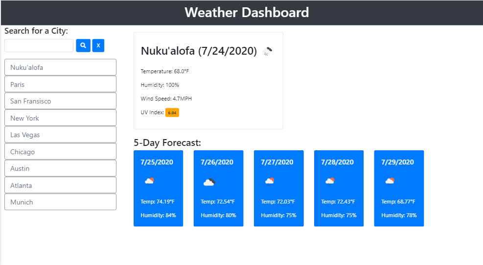

# Weather Dashboard 

## Weather Dashboard using Open Weather Map Current Weather Data and One Call API

This website uses [OpenWeather API](https://openweathermap.org/api) to retrieve weather data for cities.
Users can input the name of a city and recive current weather information (current conditions icon, temperature, humidity, windspeed, UV index) and a daily forecast in that city for the next 5 days.

City names that match OpenWeatherMap entries will be stored in the button quick bar. City weather data can be quickly reaccessed by clicking the city's button.
City names that do not match an OpenWeatherMap entry will alert the user to try another city name.

City names and city weather data are maintained in local storage for at least 10 minutes before requesting new weather data, per OpenWeatherMap api suggestion.

Pressing the 'X' button next to the city search bar will clear the button quick bar and stored city weather data. 

## Links

https://jodoedjr.github.io/WeatherDashboard/

https://github.com/jodoedjr/WeatherDashboard
